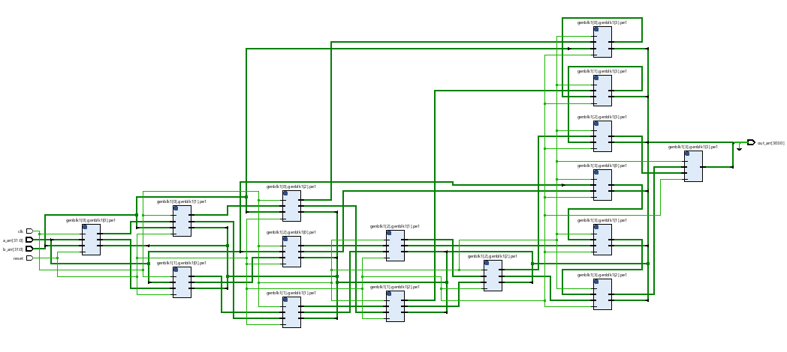

# Systolic Array for Matrix Multiplication

## Overview
This project implements a systolic array architecture for efficient matrix multiplication. The design is parameterized to support matrices of any given size (N×N) and customizable data widths.

## Features
- Supports matrix multiplication of configurable size (N×N)
- Parameterized data width for flexibility (default: 8 bits)
- Uses a systolic array of processing elements for parallel computation
- Outputs results in a linear array format
- Python scripts for generating test bench inputs and verifying outputs
- Power and resource usage analysis included

## System Design

### Data Representation
- Two input arrays, `a_arr` and `b_arr`, must be formatted specifically to be directly fed into the systolic array.
- Each input is assumed to be 8 bits wide (modifiable parameter).
- The output, `output_arr`, contains the results of all systolic array cells in a linear format.
- Maximum possible output length per cell: `2*data_size + N - 1` (to account for bit growth during multiplication and accumulation).
- Intermediate values between cells are stored in `a_intr` and `b_intr`.

### Logic Implementation
1. A **processing element (PE)** is designed to:
   - Accept two inputs
   - Perform multiplication and accumulation
   - Produce three outputs: one directed to `output_arr`, and two forwarded to the next cells
2. A **generate loop** iterates through all possible positions in the systolic array.
3. Routing between processing elements is handled using `genvar` variables `i` and `j`.
4. The number of instantiated processing elements matches the matrix size (e.g., a 4×4 systolic array for a 4×4 matrix multiplication involves 16 processing elements).

### Schematic

## Testing

### Test Bench Input Generation
- A Python script formats matrices into the required input format for the test bench.

## Performance Characteristics

### Power Analysis

### Resource Utilization
- The design exceeds the available **IOB (Input/Output Blocks)** on an FPGA due to a large number of required pins.
- Optimizations may be required to efficiently map the design onto FPGA resources.

## Future Work
- Optimizing I/O pin usage to fit within FPGA constraints.
- Enhancing the design to support larger matrices with minimal resource overhead.
- Exploring alternative hardware implementations for improved efficiency.

## Repository Contents
- **Verilog Code:** RTL implementation of the systolic array
- **Python Scripts:** Test bench input generation and output verification
- **Schematics:** Visual representation of systolic array structure
- **Power & Resource Reports:** Performance analysis documentation

